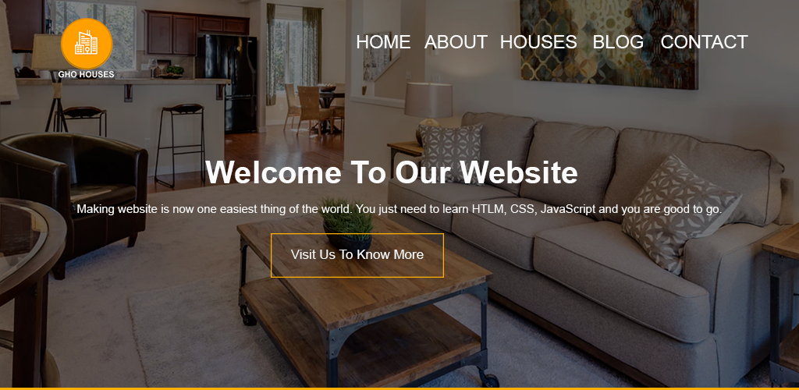

<h1 align="center">
    
</h1>

## About

Making website is now one easiest thing of the world. You just need to learn HTLM, CSS, JavaScript and you are good to go.
***
***

***
- GHO-Houses <a href="https://josuepanzo.github.io/house-gho-firm/" target="_blank">Go to Site</a>

***
***
***
***
## 🔨 Tools

- Html5
- Css3
- Javascript

***
***
***
***
## ❄ How Contribute
***
***Clone project***
***
$ git clone https://github.com/josuepanzo/house-gho-firm/

***
***
***
***
## 🙍‍♂️ Authors

  **Josué António Dias Panzo**
  ***
  - My - <a href="https://www.linkedin.com/in/josuepanzo5/" target="_blank">Linkedin</a>

Please follow github

Thanks to visiting me and good coding!
***
***
***
***
## 🧧 Licenses
***
This project is under the **MIT License**. See the file **LICENSE** for more details.